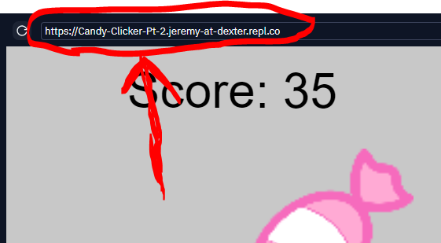

## Candy Clicker Tutorial Pt 2
In the last tutorial, we made a clickable piece of candy and a score counter. In this tutorial, we will scale the game to mobile devices using some clever math and `p5.play`'s camera feature.


## Where did we leave off?
At the end of the last tutorial, our code looked something like this:
```js
// An object representing the candy
var candy = {
    // "image" is the variable inside candy which will hold the loaded image
    // Right now it is "null", which means nothing. We will load the image
    // during the "setup" code.
    image: null,
    x: 100,
    y: 100
}
var score = 0

function setup()
{
    createCanvas(windowWidth, windowHeight);
    // Load the image into a variable
    candy.image = loadImage("candy.png")
}

function draw()
{
    background(255);
    imageMode(CENTER)
    // Resize width and height to be 100x100
    candy.image.resize(100,100)
    // Draw the image based on variables in the candy object
    image(candy.image, candy.x, candy.y)
    // Set text size
    textSize(24)
    // Draw the score text
    text("Score: " + score, 10, 30)
}

function mousePressed(){
    var d = dist(candy.x, candy.y, mouseX, mouseY)
    if(d < 40){
        score = score + 1
    }
}
```

## Removing padding
Try changing the number in `background` to `200`. That will make the background of our sketch gray. Your `draw` code should now look like this:

```js
function draw()
{
    background(200);
    imageMode(CENTER)
    // Resize width and height to be 100x100
    candy.image.resize(100,100)
    // Draw the image based on variables in the candy object
    image(candy.image, candy.x, candy.y)
    // Set text size
    textSize(24)
    // Draw the score text
    text("Score: " + score, 10, 30)
}
```

Run the code. Notice the annoying white bars on the sides of our sketch? And the scrollbars? Lets remove those. To do so, we actually have to edit the `style.css` file instead of the `script.js` file we have been editing.

The white outline is because our **HTML document**, which our **p5.js canvas** sits inside of, has something called **padding**. **Padding** means that everything **inside** an element is pushed **inward a few pixels**. Similarly **margin** means that elements **outside** are pushed **away a few pixels**. Lastly, **overflow** is how a document handles content outside of the screen. To fix our issue, we want to remove any **padding** and **margin**, as well as hide any **overflow**. (Don't show anything outside the screen) Add the following code to `style.css`:

```css
html, body
{
  padding: 0;
  margin: 0;
  overflow: hidden;
}
```

## Virtual Camera & Coordinates
To scale our game, we are going to use a virtual "camera" which determines where the screen is positioned in our game's "world". The camera moving changes where coordinates are located on the screen. That means that **(0,0)** might not be the top-left of the camera.

**IMPORTANT!** We will be using two types of coordinates from now on. **World coordinates** means the position in the game world, which is adjusted based on the camera. **Screen coordinates** means the coordinates based entirely on the screen, as if we didn't have a camera. (The top left is always **(0,0)** in screen coordinates) These will make more sense once you start using them.

## Adding P5.Play Library
To use the virtual camera, we need a special library which adds to `p5.js`'s features. The `p5.play` library adds many videogame features, including a virtual camera. To add the library, you have to add a `<script>` tag to your HTML! Add this tag below where `p5.js` is added.

```html
<script src="https://cdn.jsdelivr.net/gh/jeremyglebe/p5.play@master/lib/p5.play.js"></script>
```

Your complete HTML code should now look like this:

```html
<!DOCTYPE html>
<html>
  <head>
    <meta charset="utf-8">
    <meta name="viewport" content="width=device-width">
    <title>repl.it</title>
    <link href="style.css" rel="stylesheet" type="text/css" />
    <script src="https://cdn.jsdelivr.net/npm/p5@1.3.1/lib/p5.js"></script>
    <script src="https://cdn.jsdelivr.net/gh/jeremyglebe/p5.play@master/lib/p5.play.js"></script>
  </head>
  <body>
    <script src="script.js"></script>
  </body>
</html>
```

## Camera Positioning
`p5.play` automatically adds a new variable called `camera`. `camera` is an object which contains several variables, including another object: `camera.position`. To center the camera on the piece of candy, we only need to match the camera's position to the `x` and `y` values of the candy. Add this to your `draw` step, before you draw the background:

```js
// Reposition the camera
camera.position.x = candy.x
camera.position.y = candy.y
```

Your `draw` code should now look like:

```js
function draw()
{
    // Reposition the camera
    camera.position.x = candy.x
    camera.position.y = candy.y
    // Draw the background
    background(200);
    // Draw images from their centers
    imageMode(CENTER)
    // Resize width and height to be 100x100
    candy.image.resize(100,100)
    // Draw the image based on variables in the candy object
    image(candy.image, candy.x, candy.y)
    // Set text size
    textSize(24)
    // Draw the score text
    text("Score: " + score, 10, 30)
}
```

## Resizing/Scaling
Now we should make sure the images are zoomed in/out depending on the size of the screen. (So that they aren't tiny on big screens, or huge on small screens)

We first want to come up with a **base size**, or a size that we base all the scaling on. Since our game doesn't take up much space, let's use a very small base size and just make the image bigger when needed.

We will create two new variables, `myBase` and `myZoom` which represent the base size and the camera zoom. For now, the zoom will just be `1.0`, which means not zoomed in or out. Add them at the top of the code, with your other variables.

```js
// An object representing the candy
var candy = {
    // "image" is the variable inside candy which will hold the loaded image
    // Right now it is "null", which means nothing. We will load the image
    // during the "setup" code.
    image: null,
    x: 100,
    y: 100
}
var score = 0
var myBase = 200
var myZoom = 1.0
```

Next, we need to do two things: 1. Determine which side of our screen is smaller. (We will scale using the smaller side) 2. Calculate the zoom as a **ratio** of **real size** over **base size**.

If any of this math is unfamiliar to you (ratios, for instance) don't worry about it too much - this is something you can re-use for any project without changing the math.

Let's do the calculations in setup. We will use **if-statements** to determine which side is smaller. Then, we will calculate the zoom and store it in `myZoom`. Lastly, we will copy the value of `myZoom` to `camera.zoom`. 

```js
function setup()
{
    createCanvas(windowWidth, windowHeight);
    // Load the image into a variable
    candy.image = loadImage("candy.png")
    // Calculate the zoom of the camera
    if(width < height){
        myZoom = width / myBase
    }
    else {
        myZoom = height / myBase
    }
    camera.zoom = myZoom
}
```

**So why do we have `myZoom` if `camera.zoom` already exists?** We might be changing the `camera.zoom` variable any time we want to do a camera effect, so it is nice to remember the original zoom level using the variable `myZoom`.

## The "Click"
If you test your game now, you'll notice that your click is no longer working. That is because `mouseX` and `mouseY`, used in your `mousePressed` code, are based on **screen coordinates** and not **world coordinates**. So those variables are no longer ever near your candy's position.

Luckily, `p5.play` includes a new version of these variables, which uses **world coordinates**: `camera.mouseX` and `camera.mouseY`. Replace the variables in `mousePressed` with the new versions:

```js
function mousePressed(){
    var d = dist(candy.x, candy.y, camera.mouseX, camera.mouseY)
    if(d < 40){
        score = score + 1
    }
}
```

There is still a problem. The `40` that we used to make sure the click was near our candy hasn't been scaled based on the zoom. So now I have to click perfectly in the center of the candy to increase my score. All we need to do is scale `40` by the same amount as everything else, which we can do by multiplying it by `myZoom`! Try it:

```js
function mousePressed(){
    var d = dist(candy.x, candy.y, camera.mouseX, camera.mouseY)
    if(d < 40 * myZoom){
        score = score + 1
    }
}
```

## Button Pressed Camera Effect
Lets add one more feature, just for fun. The camera will zoom in for a moment when we click the candy, making it look like it is being pressed. We will increase the camera zoom in the `mousePressed` code, and reset it in a new code block called `mouseReleased`.

```js
function mousePressed(){
    var d = dist(candy.x, candy.y, camera.mouseX, camera.mouseY)
    if(d < 40 * myZoom){
        score = score + 1
    }
    camera.zoom = myZoom + .5
}

function mouseReleased(){
    camera.zoom = myZoom
}
```

Cool right?

## Testing on Mobile
To run this on your phone, try opening the link right above the game window in your phone's browser.



You should see that it works quite nicely!

## Conclusion
You now have a clicker game fully working on mobile. It will scale to any device and look decent on all of them! In the future, we may integrate a multiplayer system so that everyone can add to the score together. Games like this also normally include upgrades you can buy with your points you getting.