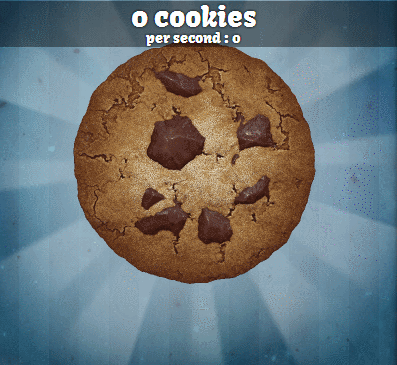

# Candy Clicker Tutorial
We are going to make a clicker game, which is a simple game where you click on an object to increase some score, money, or other number. One example of an early clicker game is [Cookie Clicker.](https://orteil.dashnet.org/cookieclicker/) Our clicker game is going to be much simpler. We will show a piece of candy and, when clicked, raise a score value. Of course, you can always add more features as you learn more!



## Getting Started
The first thing you need to do is **create a new replit project** using the **p5.js template**. You should see the following code:

```js
let colorlist = ['gold', 'yellow', 'turquoise', 'red']

function setup() {
  createCanvas(windowWidth, windowHeight);
    background(255);
}

function draw() {
  noStroke()
  fill(random(colorlist));
  ellipse(mouseX, mouseY, 25, 25);
}
```

We can remove most of this starter code. Delete the `colorlist` variable as well as all the code contained inside the `draw` function. Now move the `background` command from the `setup` function to the `draw` function. This actually makes sure the screen is cleared each time we re-draw it. Your code should now look like this:

```js
function setup()
{
  createCanvas(windowWidth, windowHeight);
}

function draw()
{
  background(255);
}
```

## Displaying an Image
Next we need to load an image into the game to be our candy. You can use the following image, if you'd like. You should be able to right click it to save it, then upload it to your replit project.


We have to write code to load the image first. Loading just makes sure we have a variable holding the image. Drawing the image is a separate step. Load the image using the `loadImage` command the the name of the file.

It will also be best if we put the image in an object because objects help us to group related variables together. We have to load the image in `setup`, but we should create the candy object before `setup` so it can be used everywhere.

```js
// An object representing the candy
var candy = {
    // "image" is the variable inside candy which will hold the loaded image
    // Right now it is "null", which means nothing. We will load the image
    // during the "setup" code.
    image: null
}

function setup()
{
  createCanvas(windowWidth, windowHeight);
  // Load the image into a variable
  candy.image = loadImage("candy.png")
}

function draw()
{
  background(255);
}
```

The image still doesn't show up on the screen. We need to add the `image` command to the draw code. We will provide `image` the variable which has our loaded image of candy. `image` will also expect an x and y position, so add those to the `candy` object.

```js
// An object representing the candy
var candy = {
    // "image" is the variable inside candy which will hold the loaded image
    // Right now it is "null", which means nothing. We will load the image
    // during the "setup" code.
    image: null,
    x: 100,
    y: 100
}

function setup()
{
    createCanvas(windowWidth, windowHeight);
    // Load the image into a variable
    candy.image = loadImage("candy.png")
}

function draw()
{
    background(255);
    // Draw the image based on variables in the candy object
    image(candy.image, candy.x, candy.y)
}
```

## Image Adjustments

`candy.x` and `candy.y` are both `100` at the moment. You might notice that it is the top-left corner of the image which is at **(100,100)**. When I specify a coordinate for an image, I would like it to be placed squarely on that location. We can fix that using `imageMode(CENTER)`.

```js
function draw()
{
    background(255);
    imageMode(CENTER)
    // Draw the image based on variables in the candy object
    image(candy.image, candy.x, candy.y)
}
```

**Whoah**, let's make that image smaller. We can use the `resize` command to tell it how big to be. Interestingly, `resize` is used with a `.` on the image variable. (That is because the image variable is also a kind of object)

```js
function draw()
{
    background(255);
    imageMode(CENTER)
    // Resize width and height to be 100x100
    candy.image.resize(100,100)
    // Draw the image based on variables in the candy object
    image(candy.image, candy.x, candy.y)
}
```

## Scorekeeping
The image is now a sensible size and is placed correctly. Now we need to create a score variable, and display that score with `text`. We also want to set the size of the text in pixels with `textSize`. See the code below.

```js
var score = 0

function draw()
{
    background(255);
    imageMode(CENTER)
    // Resize width and height to be 100x100
    candy.image.resize(100,100)
    // Draw the image based on variables in the candy object
    image(candy.image, candy.x, candy.y)
    // Set text size
    textSize(24)
    // Draw the score text
    text("Score: " + score, 10, 30)
}
```

## Mouse Clicking
Now it is time to add the "click" part of our clicker game! Luckily, **p5.js** has a special function for detecting clicks. Add the following function to your code.

```js
function mousePressed(){
    
}
```

The code inside it will run any time you click on the screen. So, lets add code which increases the score.

```js
function mousePressed(){
    score = score + 1
}
```

I suppose we could call this done! Well, except one little thing that bothers me. Right now, you can click anywhere to increase the score. Ideally, you would need to click on the candy to increase the score! We aren't needing it to be perfect, but we can at least make sure the click is **near** the candy. Let's calculate the distance between the candy and the mouse using the `dist` command, our `candy` object, and the **p5.js** variables `mouseX` and `mouseY`. (`dist` expects two coordinates to calculate distance between)

```js
function mousePressed(){
    var d = dist(candy.x, candy.y, mouseX, mouseY)
    score = score + 1
}
```

Now we will use that distance to determine whether the score should be increased. Experiment around with a few numbers, but I discovered that requiring the distance to be less than 40 pixels worked well for me.


## Conclusion
That's it! You have a basic clicker game created! Next tutorial we will make the game more playable for phones and other mobile devices. For now, congratualations on getting this far!
