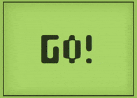

# Snake Starter Tutorial Pt 2
In the last tutorial, we made a snake head that can move around the screen. This time, we are going to make food for the snake head to eat and display a score.



## Where did we leave off?
At the end of the last tutorial, our code looked something like this:
```js
// Snake object variable
var snake = 
{
  color: 'green', // Maybe we could customize the color for each player later?
  size: 15, // This is the size of one square of the snake
  direction: 'none', // 'none', 'up', 'down', 'left', or 'right'
  x: 0, // This is the X coordinate of snake's location
  y: 0 // This is the Y coordinate of snake's location
}

function setup()
{
  frameRate(5) // This changes the frame rate to 5 frames per second
  createCanvas(windowWidth, windowHeight);
  background(255);
}

function draw()
{
  // Paint over the old frame
  background(255)
  // Move the snake
  if(snake.direction == 'up')
  {
    snake.y = snake.y - snake.size
  }
  else if (snake.direction == 'down')
  {
    snake.y = snake.y + snake.size
  }
  else if(snake.direction == 'left')
  {
    snake.x = snake.x - snake.size
  }
  else if (snake.direction == 'right')
  {
    snake.x = snake.x + snake.size
  }
  // Draw the snake
  fill(snake.color) // Set the color of the snake
  // Draw the square at the snake's x and y with a side length equal to the snake's size
  square(snake.x, snake.y, snake.size) 
}

function keyPressed()
{
  if (keyCode == UP_ARROW)
  {
    // This runs when the up arrow key is pressed
    snake.direction = 'up'
  }
  else if (keyCode == DOWN_ARROW)
  {
    // This runs when the down arrow key is pressed
    snake.direction = 'down'
  }
  else if (keyCode == LEFT_ARROW)
  {
    // This runs when the left arrow key is pressed
    snake.direction = 'left'
  }
  else if (keyCode == RIGHT_ARROW)
  {
    // This runs when the right arrow key is pressed
    snake.direction = 'right'
  }
}
```

## Placing The Food
Our next goal is to place food items for the snake to collect. The tricky part is that we want the location of the food to be **random**. The good news is, **p5.js** comes with a command called `random`! You provide `random` the smallest possible number to use and the largest, then it gives you a random number between those. For example:

```js
var x = random(50, 150)
var y = 150
circle(x, y, 15)
// This creates a 30 pixel wide circle at 150 pixels down the screen,
// and some random number of pixels between 50 and 150 to the right
```

So we need to create a **food object** with a **random x** and a **random y**. You should be familiar with how to make an object by now, but look at how we use the `random` command to choose the food location in the code below:

```js
// Food object variable
var food =
{
  radius: 15,
  x: 0,
  y: 0
}

function setup()
{
  frameRate(5) // This changes the frame rate to 5 frames per second
  createCanvas(windowWidth, windowHeight);
  background(255);
  // Random food object location
  food.x = random(0, width)
  food.y = random(0, height)
}
```

**Note:** Since we are using a **p5.js** command, we have to use it inside of a **p5.js** function like `setup`. That means we will need to change the food's location to be random during `setup` instead of when we first create it. Study the code above to see what I mean.

Now, let's add some code to show the food to the `draw` function! This is easy, we just want to draw a circle at the food location, using the `circle` command and the variables inside of `food`:

```js
// Draw the food
circle(food.x, food.y, food.radius)
```

And we need to place that code at the bottom of the draw function:

```js
function draw()
{
  // Paint over the old frame
  background(255)
  // Move the snake
  if(snake.direction == 'up')
  {
    snake.y = snake.y - snake.size
  }
  else if (snake.direction == 'down')
  {
    snake.y = snake.y + snake.size
  }
  else if(snake.direction == 'left')
  {
    snake.x = snake.x - snake.size
  }
  else if (snake.direction == 'right')
  {
    snake.x = snake.x + snake.size
  }
  // Draw the snake
  fill(snake.color) // Set the color of the snake
  // Draw the square at the snake's x and y with a side length equal to the snake's size
  square(snake.x, snake.y, snake.size) 
  // Draw the food
  circle(food.x, food.y, food.radius)
}
```

## Detect Touching
The first thing we need to do is figure out when the snake head is touching the food. The easiest way to do this is to calculate the distance between the head and the food and if that distance is small enough we consider them to be touching.

Calculating distance is a very mathematic process, you can learn about it here if you want to: [https://www.mathsisfun.com/algebra/distance-2-points.html](https://www.mathsisfun.com/algebra/distance-2-points.html) Luckily for us, we don't need to do all that math! **p5.js** has a command called `dist` already built in! `dist` expects you to provide it with two pairs of **x** and **y**. Look at how to use it below:

```js
var x = 10;
var y = 90;
// Here, "d" is the length in pixels between the mouse and the point (10,90)
var d = dist(x, y, mouseX, mouseY);
```

Let's calculate the distance between the snake and the food each time `draw` runs:

```js
// Calculate distance between snake and food
var d = dist(snake.x, snake.y, food.x, food.y)
```

Now, to determine if the snake and food are touching, we need to see if the distance is less than some number. Let's use the number `15`. (If you didn't like the results of this number, this is when you would experiment and change the number until it seems right)

```js
// Calculate distance between snake and food
var d = dist(snake.x, snake.y, food.x, food.y)
// Test if the snake and food are touching
if (d < 15)
{
  // Write the code for "eating" the food below
}
```

## How to "Eat" Food?

Sometimes, things in games aren't really what they appear to be. Every time the snake "eats" a piece of food, a new piece of food is created. So instead of actually making a new piece of food, we can just move the food that is already there! See how we do this below:

```js
// Calculate distance between snake and food
var d = dist(snake.x, snake.y, food.x, food.y)
// Test if the snake and food are touching
if (d < 15)
{
  // Write the code for "eating" the food below
  food.x = random(0, width)
  food.y = random(0, height)
}
```

Now, so that we check if the snake can eat the food each time it moves, we need to place that code into our `draw` function. The way the game behaves changes slightly depending on where in the `draw` function you add this code. I recommend putting it after the snake moves, but before drawing the snake and food. You can try putting it in different locations to see how the game changes. Refer to the code below for my version:

```js
function draw()
{
  // Paint over the old frame
  background(255)
  // Move the snake
  if(snake.direction == 'up')
  {
    snake.y = snake.y - snake.size
  }
  else if (snake.direction == 'down')
  {
    snake.y = snake.y + snake.size
  }
  else if(snake.direction == 'left')
  {
    snake.x = snake.x - snake.size
  }
  else if (snake.direction == 'right')
  {
    snake.x = snake.x + snake.size
  }
  // Calculate distance between snake and food
  var d = dist(snake.x, snake.y, food.x, food.y)
  // Test if the snake and food are touching
  if (d < 15)
  {
    // Write the code for "eating" the food below
    food.x = random(0, width)
    food.y = random(0, height)
  }
  // Draw the snake
  fill(snake.color) // Set the color of the snake
  // Draw the square at the snake's x and y with a side length equal to the snake's size
  square(snake.x, snake.y, snake.size) 
  // Draw the food
  circle(food.x, food.y, food.radius)
}
```

Let's keep track of a score variable which starts out as `0` and is increased each time we eat food. At the top of your code, above the `var snake`, add the following:

```js
// Score variable
var score = 0
```

Now, in the section of code where we "eat" the food, let's also increase that score:

```js
// Test if the snake and food are touching
if (d < 15)
{
  // Write the code for "eating" the food below
  food.x = random(0, width)
  food.y = random(0, height)
  score = score + 1
}
```

Lastly, we need to show that score! So we use the **p5.js** command called `text` to show some text on the screen. `text` requires you to tell it what text to show and the **x** and **y** location:

```js
// Show the score
textSize(32) // You can also use "textSize" to decide how big the text should be
text("Score: " + score, 0, height)
```

The above code shows "Score: 0" in the bottom left corner. (x=0, y=height) When `score` gets bigger than 0, it will show whatever the current number is. (We can add numbers to strings to make them a part of the string)

Now we need to add that `text` command to the `draw` function so it shows up! Look below:

```js
function draw()
{
  // Paint over the old frame
  background(255)
  // Move the snake
  if(snake.direction == 'up')
  {
    snake.y = snake.y - snake.size
  }
  else if (snake.direction == 'down')
  {
    snake.y = snake.y + snake.size
  }
  else if(snake.direction == 'left')
  {
    snake.x = snake.x - snake.size
  }
  else if (snake.direction == 'right')
  {
    snake.x = snake.x + snake.size
  }
  // Calculate distance between snake and food
  var d = dist(snake.x, snake.y, food.x, food.y)
  // Test if the snake and food are touching
  if (d < 15)
  {
    // Write the code for "eating" the food below
    food.x = random(0, width)
    food.y = random(0, height)
    score = score + 1
  }
  // Draw the snake
  fill(snake.color) // Set the color of the snake
  // Draw the square at the snake's x and y with a side length equal to the snake's size
  square(snake.x, snake.y, snake.size) 
  // Draw the food
  circle(food.x, food.y, food.radius)
  // Show the score
  textSize(32) // You can also use "textSize" to decide how big the text should be
  text("Score: " + score, 0, height)
}
```

Run this, and you will see that your snake game now keeps track of score!

## Conclusion
This is all we are going to do for this project. I wanted everyone to get a real feeling of how making games, and game controls, is done in code. We are missing several features from snake, including the snake growing bigger and a way to lose the game. We will come back to the snake game in a later project. (During which we will make it work on your phone!) However, before we can return to it, we need to learn about **arrays** and **functions**. For now, just be proud that you have created a game with working controls! That is no easy feat!