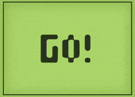

# Snake Starter Tutorial Pt 3
In the last tutorial, we made a snake head that can eat food and increase a score variable. This time, using the power of arrays & loops, we are going to make it so that the snake grows in size, moves along a square grid.



## Where did we leave off?
At the end of the last tutorial, our code looked something like this:
```js
// Snake object variable
var snake = 
{
  color: 'green', // Maybe we could customize the color for each player later?
  size: 15, // This is the size of one square of the snake
  direction: 'none', // 'none', 'up', 'down', 'left', or 'right'
  x: 0, // This is the X coordinate of snake's location
  y: 0 // This is the Y coordinate of snake's location
}
// Food object variable
var food =
{
  radius: 15,
  x: 0,
  y: 0
}
// Score variable
var score = 0

function setup()
{
  frameRate(5) // This changes the frame rate to 5 frames per second
  createCanvas(windowWidth, windowHeight);
  background(255);
  // Random food object location
  food.x = random(0, width)
  food.y = random(0, height)
}

function draw()
{
  // Paint over the old frame
  background(255)
  // Move the snake
  if(snake.direction == 'up')
  {
    snake.y = snake.y - snake.size
  }
  else if (snake.direction == 'down')
  {
    snake.y = snake.y + snake.size
  }
  else if(snake.direction == 'left')
  {
    snake.x = snake.x - snake.size
  }
  else if (snake.direction == 'right')
  {
    snake.x = snake.x + snake.size
  }
  // Calculate distance between snake and food
  var d = dist(snake.x, snake.y, food.x, food.y)
  // Test if the snake and food are touching
  if (d < 15)
  {
    // Write the code for "eating" the food below
    food.x = random(0, width)
    food.y = random(0, height)
    score = score + 1
  }
  // Draw the snake
  fill(snake.color) // Set the color of the snake
  // Draw the square at the snake's x and y with a side length equal to the snake's size
  square(snake.x, snake.y, snake.size) 
  // Draw the food
  circle(food.x, food.y, food.radius)
  // Show the score
  textSize(32) // You can also use "textSize" to decide how big the text should be
  text("Score: " + score, 0, height)
}

function keyPressed()
{
  if (keyCode == UP_ARROW)
  {
    // This runs when the up arrow key is pressed
    snake.direction = 'up'
  }
  else if (keyCode == DOWN_ARROW)
  {
    // This runs when the down arrow key is pressed
    snake.direction = 'down'
  }
  else if (keyCode == LEFT_ARROW)
  {
    // This runs when the left arrow key is pressed
    snake.direction = 'left'
  }
  else if (keyCode == RIGHT_ARROW)
  {
    // This runs when the right arrow key is pressed
    snake.direction = 'right'
  }
}
```

## Growing the Snake
The first feature to add to our code is the ability for the snake to grow in size. To do this, we need to add an array which will hold each piece of the snake's body.

```js
// Snake's body pieces
var body = []
```

So how do we add a piece to the snake's body when he eats? Well first we need to `push` a new object to the array when food gets eaten. That object should have an x and y position equal to the snake's position. As a side note: We should move the snake's "eating" code **before** the snake moves, so that new body parts appear **behind** the snake.

```js
function draw()
{
  // Paint over the old frame
  background(255)
  // Calculate distance between snake and food
  var d = dist(snake.x, snake.y, food.x, food.y)
  // Test if the snake and food are touching
  if (d < 15)
  {
    // Write the code for "eating" the food below
    food.x = random(0, width)
    food.y = random(0, height)
    score = score + 1
    body.push({
        x: snake.x,
        y: snake.y,
    })
  }
  // Move the snake
  if(snake.direction == 'up')
  {
    snake.y = snake.y - snake.size
  }
  else if (snake.direction == 'down')
  {
    snake.y = snake.y + snake.size
  }
  else if(snake.direction == 'left')
  {
    snake.x = snake.x - snake.size
  }
  else if (snake.direction == 'right')
  {
    snake.x = snake.x + snake.size
  }
  // Draw the snake
  fill(snake.color) // Set the color of the snake
  // Draw the square at the snake's x and y with a side length equal to the snake's size
  square(snake.x, snake.y, snake.size) 
  // Draw the food
  circle(food.x, food.y, food.radius)
  // Show the score
  textSize(32) // You can also use "textSize" to decide how big the text should be
  text("Score: " + score, 0, height)
}
```

The data for the body piece is there now, but it isn't being drawn. In the `draw` code we need to add a **loop** which will run the same code for every body piece in the `body` variable. I'll show you how!

```js
// Draw the snake
fill(snake.color) // Set the color of the snake
// Draw the square at the snake's x and y with a side length equal to the snake's size
square(snake.x, snake.y, snake.size) 
// Draw the food
circle(food.x, food.y, food.radius)
// Show the score
textSize(32) // You can also use "textSize" to decide how big the text should be
text("Score: " + score, 0, height)
// Draw every body piece
for(var piece of body){
    square(piece.x, piece.y, snake.size)
}
```

You'll notice, however, that the snake's body isn't moving! Lets start by moving just the piece of the snake immediately behind the head. If the body of the snake is bigger than 0, we need to move that piece to the head. (We need to do this **before** the head itself moves, or they'll just end up in the same spot)

```js
// Move the piece immediately behind the head
if(body.length > 0){
    body[0].x = snake.x
    body[0].y = snake.y
}
// Move the snake
if(snake.direction == 'up')
{
snake.y = snake.y - snake.size
}
else if (snake.direction == 'down')
{
snake.y = snake.y + snake.size
}
else if(snake.direction == 'left')
{
snake.x = snake.x - snake.size
}
else if (snake.direction == 'right')
{
snake.x = snake.x + snake.size
}
```

Now we need to move the rest of the body. The **for loop** we're using is a bit complicated, but basically it runs backwards through the array, moving each snake piece to where the one before it is.

```js
// Move snake body parts
for(var i = body.length-1; i > 0; i--){
    body[i].x = body[i-1].x
    body[i].y = body[i-1].y
}
// Move the piece immediately behind the head
if(body.length > 0){
    body[0].x = snake.x
    body[0].y = snake.y
}
```

## A Quick Aside: Functions
You may have noticed our code inside of things like `draw` has started to become **huge**. Sometimes it is useful, for organizing purposes, to put big chunks of code into their own code blocks called **functions**. We have been using special **p5.js** functions so far (`draw`, `setup`) but we can make our own as well to separate code and use them wherever we want. For instance, I can put all of my snake movement code into one function called `moveSnake` and then replace all that code in `draw` with a single command: `moveSnake()`.

Here is the full code with that feature added:

```js
// Snake object variable
var snake = 
{
  color: 'green', // Maybe we could customize the color for each player later?
  size: 15, // This is the size of one square of the snake
  direction: 'none', // 'none', 'up', 'down', 'left', or 'right'
  x: 0, // This is the X coordinate of snake's location
  y: 0, // This is the Y coordinate of snake's location
}
// Snake's body pieces
var body = []
// Food object variable
var food =
{
  radius: 15,
  x: 0,
  y: 0
}
// Score variable
var score = 0

function setup()
{
  frameRate(5) // This changes the frame rate to 5 frames per second
  createCanvas(windowWidth, windowHeight);
  background(255);
  // Random food object location
  food.x = random(0, width)
  food.y = random(0, height)
  // Snake should be placed by its center for collision detection
  rectMode(CENTER)
}

function draw()
{
  // Paint over the old frame
  background(255)
  // Calculate distance between snake and food
  var d = dist(snake.x, snake.y, food.x, food.y)
  // Test if the snake and food are touching
  if (d < 15)
  {
    // Write the code for "eating" the food below
    food.x = random(0, width)
    food.y = random(0, height)
    score = score + 1
    body.push({
        x: snake.x,
        y: snake.y,
    })
  }
  // Use the moveSnake function to run all of its code
  moveSnake()
  // Draw the snake
  fill(snake.color) // Set the color of the snake
  // Draw the square at the snake's x and y with a side length equal to the snake's size
  square(snake.x, snake.y, snake.size) 
  // Draw the food
  circle(food.x, food.y, food.radius)
  // Show the score
  textSize(32) // You can also use "textSize" to decide how big the text should be
  text("Score: " + score, 0, height)
  // Draw every body piece
  for(var piece of body){
      square(piece.x, piece.y, snake.size)
  }
}

function keyPressed()
{
  if (keyCode == UP_ARROW)
  {
    // This runs when the up arrow key is pressed
    snake.direction = 'up'
  }
  else if (keyCode == DOWN_ARROW)
  {
    // This runs when the down arrow key is pressed
    snake.direction = 'down'
  }
  else if (keyCode == LEFT_ARROW)
  {
    // This runs when the left arrow key is pressed
    snake.direction = 'left'
  }
  else if (keyCode == RIGHT_ARROW)
  {
    // This runs when the right arrow key is pressed
    snake.direction = 'right'
  }
}

function moveSnake(){
  // Move snake body parts
  for(var i = body.length-1; i > 0; i--){
      body[i].x = body[i-1].x
      body[i].y = body[i-1].y
  }
  // Move the piece immediately behind the head
  if(body.length > 0){
      body[0].x = snake.x
      body[0].y = snake.y
  }
  // Move the snake
  if(snake.direction == 'up')
  {
    snake.y = snake.y - snake.size
  }
  else if (snake.direction == 'down')
  {
    snake.y = snake.y + snake.size
  }
  else if(snake.direction == 'left')
  {
    snake.x = snake.x - snake.size
  }
  else if (snake.direction == 'right')
  {
    snake.x = snake.x + snake.size
  }
}
```

Notice how much smaller `draw` seems? Sure, we didn't **get rid of** any code, but now it is much easier to organize. Any time we need to change anything about how the snake moves, it has its own section of code. Let's try to use **functions** in the future to improve the readability of our game code.

## Drawing the Grid
Let's try to draw a square grid showing exactly where the "spaces" the snake occupies are at. To do so, we use a "loop" and draw lines across the screen over and over again at different intervals. Let's create a new **function** called `grid`, which will contain code to draw these lines.

```js
function grid(){
    
}
```

Now we use two **for loops** to draw lines over and over again, across the screen.

```js
function grid(){
  // Grid square size = snake size
  var size = snake.size
  for (var r = 0; r < height / size; r++){
    line(0, r*size, width, r*size)
  }
  for (var c = 0; c < width / size; c++){
    line(c*size, 0, c*size, height)
  }
}
```

Go back to `draw` and add the `grid` command right after the `background` command, this will draw the grid first before everything else.

```js
// Paint over the old frame
background(255)
// Draw the grid over the background
grid()
```

Now you should have a working grid!

## Bonus Feature: Centered Snake
You may have noticed something odd about the snake colliding with the food. It seems to be inconsistent how close you have to be to it. That is because right now the snake is positioned based on its top-left corner. (All rectangles are placed this way by default)

So when we measure distance, it is actually the distance between the center of the food's circle and the top-left of the snake's head. Ideally, we would measure the distance from center to center. To do this, we just need to start drawing rectangles based on their center.

In `setup`, add the following line of code:
```js
// Snake should be placed by its center for collision detection
rectMode(CENTER)
```

Repositioning the snake like this means, however, that it doesn't line up with the grid at **(0,0)**. That's okay! We just need to make it start at a slightly different location. Change the snake variable at the top of the code to start at **(7.5,7.5)**. **7.5** is half the snake's size, so if you change the snake's size you should also change the `x` and `y` to be half of `size`.

## Conclusion
This is a good start for a snake game - next time we can make it so that the player can lose, the food lines up with the grid, and generally clean up the game's appearance.